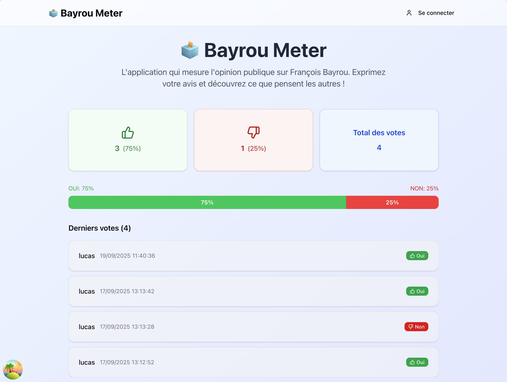
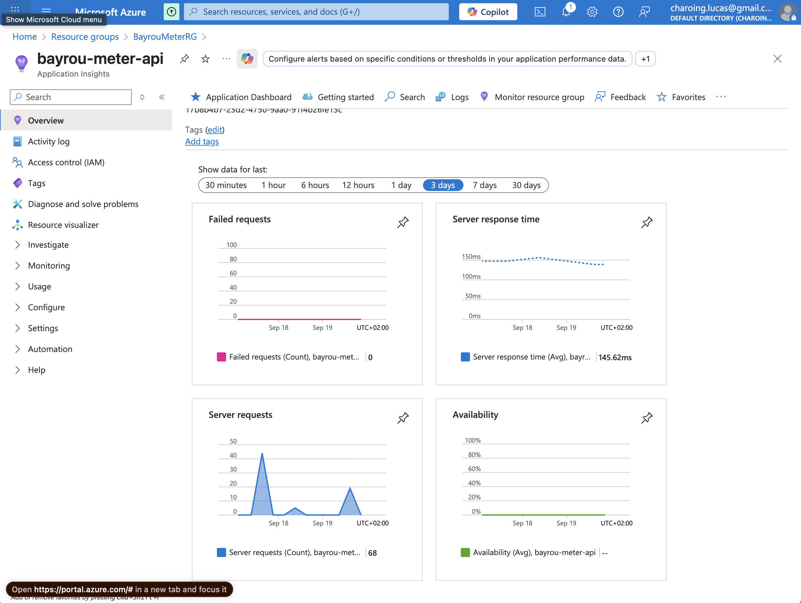

# 🗳️ Bayrou Meter

Une application web moderne pour mesurer l'opinion publique sur François Bayrou avec la question : **"Est-ce que François Bayrou nous manque ?"**


## 📋 Fonctionnalités

### ✅ Fonctionnalités implémentées

- **Identification utilisateur** : Création d'un compte avec pseudo + email
- **Système de vote** : Vote Oui/Non à la question sur François Bayrou
- **Consultation des résultats** : Affichage en temps réel des votes et statistiques
- **Interface moderne** : UI responsive avec TailwindCSS
- **Temps réel** : Actualisation automatique des résultats toutes les 5 secondes

## 🏗️ Architecture de l'application

### Vue d'ensemble
L'application suit une architecture serverless moderne sur Azure avec séparation claire entre frontend et backend.

### Composants principaux

#### Frontend (React + TypeScript)
- **Framework** : React 19 avec TypeScript
- **Routage** : TanStack Router pour la navigation
- **État global** : TanStack Query pour la gestion des données
- **Styling** : TailwindCSS pour l'interface utilisateur
- **Build** : Vite pour le bundling et le développement
- **Hébergement** : Azure Static Web Apps

#### Backend (Azure Functions)
- **Runtime** : Python 3.10
- **Architecture** : Serverless avec Azure Functions
- **API** : REST API avec endpoints CRUD
- **Authentification** : Système simple avec bcrypt pour les mots de passe

#### Base de données
- **Type** : Azure Cosmos DB (NoSQL)
- **Collections** :
  - `users` : Stockage des utilisateurs (pseudo, email, mot de passe hashé)
  - `votes` : Stockage des votes avec référence utilisateur

#### Monitoring et observabilité
- **Application Insights** : Monitoring des performances et erreurs
- **Azure Monitor** : Métriques système et alertes
- **Logs** : Centralisation des logs applicatifs

### Flux de données

1. **Inscription/Connexion** : L'utilisateur s'inscrit ou se connecte via le frontend
2. **Authentification** : Le backend valide les credentials et retourne les informations utilisateur
3. **Vote** : L'utilisateur soumet son vote (Oui/Non) qui est stocké en base
4. **Consultation** : Les résultats sont récupérés en temps réel et affichés avec statistiques

### Sécurité
- Mots de passe hashés avec bcrypt
- Validation des données côté backend
- CORS configuré pour les domaines autorisés
- Un utilisateur ne peut voter qu'une seule fois

## 🚀 Démarrage rapide

### Prérequis

- Node.js 18+
- Python 3.10+
- Azure CLI
- Azure Functions Core Tools 4.x

### Installation locale

1. **Cloner le projet**
   ```bash
   git clone <votre-repo>
   cd bayrou-meter
   ```

2. **Configuration de l'API**
   ```bash
   cd bayrou-meter-api
   cp local.settings.example.json local.settings.json
   # Éditer local.settings.json avec vos clés Cosmos DB
   pip install -r requirements.txt
   ```

3. **Configuration du Frontend**
   ```bash
   cd ../frontend
   cp .env.example .env
   # Éditer .env si nécessaire
   npm install
   ```

4. **Lancer en développement**
   ```bash
   # Terminal 1 - API
   cd bayrou-meter-api
   func start

   # Terminal 2 - Frontend
   cd frontend
   npm run dev
   ```

5. **Accéder à l'application**
   - Frontend : http://localhost:3000
   - API : http://localhost:7071/api

## 📡 API REST - Endpoints disponibles

### 🔐 Gestion des utilisateurs

#### `POST /api/user` - Créer un utilisateur
**Description** : Inscription d'un nouvel utilisateur

**Payload** :
```json
{
  "pseudo": "string (requis)",
  "email": "string (requis, unique)",
  "password": "string (requis)"
}
```

**Réponse succès (201)** :
```json
{
  "status": "success",
  "user": {
    "id": "uuid",
    "pseudo": "string",
    "email": "string"
  }
}
```

**Erreurs possibles** :
- `400` : Données manquantes ou invalides
- `409` : Email déjà existant

#### `POST /api/login` - Connexion utilisateur
**Description** : Authentification d'un utilisateur existant

**Payload** :
```json
{
  "email": "string (requis)",
  "password": "string (requis)"
}
```

**Réponse succès (200)** :
```json
{
  "status": "success",
  "user": {
    "id": "uuid",
    "pseudo": "string",
    "email": "string"
  }
}
```

**Erreurs possibles** :
- `400` : Données manquantes
- `401` : Email ou mot de passe incorrect

### 🗳️ Gestion des votes

#### `POST /api/vote` - Soumettre un vote
**Description** : Enregistrer le vote d'un utilisateur

**Payload** :
```json
{
  "user_id": "uuid (requis)",
  "choice": "oui|non (requis)"
}
```

**Réponse succès (201)** :
```json
{
  "status": "success",
  "vote": {
    "id": "uuid",
    "user_id": "uuid",
    "choice": "oui|non",
    "question": "Est-ce que François Bayrou nous manque ?"
  }
}
```

**Erreurs possibles** :
- `400` : Données manquantes ou choix invalide
- `404` : Utilisateur non trouvé
- `409` : L'utilisateur a déjà voté

#### `GET /api/votes` - Récupérer les votes et statistiques
**Description** : Obtenir tous les votes avec statistiques agrégées

**Réponse succès (200)** :
```json
{
  "votes": [
    {
      "id": "uuid",
      "user": {
        "id": "uuid",
        "pseudo": "string"
      },
      "choice": "oui|non",
      "question": "Est-ce que François Bayrou nous manque ?",
      "created_at": "ISO_date"
    }
  ],
  "stats": {
    "oui": 42,
    "non": 28,
    "total": 70,
    "oui_percentage": 60.0,
    "non_percentage": 40.0
  },
  "question": "Est-ce que François Bayrou nous manque ?"
}
```

### 📊 Codes de statut HTTP
- `200` : Succès
- `201` : Ressource créée
- `400` : Requête invalide
- `401` : Non autorisé
- `404` : Ressource non trouvée
- `409` : Conflit (ressource déjà existante)
- `500` : Erreur serveur

## 🗄️ Structure de la base de données

### Collection `users`
```json
{
  "id": "uuid",
  "pseudo": "string",
  "email": "string",
  "created_at": "ISO_date"
}
```

### Collection `votes`
```json
{
  "id": "uuid",
  "user_id": "uuid",
  "choice": "oui|non",
  "question": "Est-ce que François Bayrou nous manque ?",
  "created_at": "ISO_date"
}
```

## 🚀 Déploiement

Voir le guide détaillé dans [deploy.md](./deploy.md)

### Ressources Azure nécessaires

- Resource Group : `BayrouMeterRG`
- Cosmos DB : `bayroudb<login>` avec base `BayrouMeterDB`
- Function App : `bayrou-api-<login>`
- Static Web App : `bayrou-frontend-<login>`
- Storage Account : `bayroustorage<login>`

## 🧪 Instructions pour exécuter/tester localement

### Configuration de l'environnement de développement

#### 1. Prérequis système
```bash
# Vérifier les versions
node --version  # >= 18.0.0
python --version  # >= 3.10.0
az --version  # Azure CLI
func --version  # Azure Functions Core Tools >= 4.0
```

#### 2. Configuration des variables d'environnement

**Backend (api/local.settings.json)** :
```json
{
  "IsEncrypted": false,
  "Values": {
    "AzureWebJobsStorage": "",
    "FUNCTIONS_WORKER_RUNTIME": "python",
    "COSMOS_URL": "https://your-cosmos-account.documents.azure.com:443/",
    "COSMOS_KEY": "your-cosmos-primary-key"
  }
}
```

**Frontend (frontend/.env)** :
```bash
VITE_API_URL=http://localhost:7071/api
```

#### 3. Installation et démarrage

```bash
# 1. Cloner et installer les dépendances
git clone <votre-repo>
cd bayrou-meter

# 2. Backend - API
cd api
pip install -r requirements.txt
func start  # Démarre sur http://localhost:7071

# 3. Frontend - Interface (nouveau terminal)
cd ../frontend
npm install
npm run dev  # Démarre sur http://localhost:5173
```

### Tests manuels de l'API

#### Test complet du workflow

```bash
# 1. Créer un utilisateur
curl -X POST http://localhost:7071/api/user \
  -H "Content-Type: application/json" \
  -d '{
    "pseudo": "testuser",
    "email": "test@example.com",
    "password": "motdepasse123"
  }'

# Réponse attendue:
# {
#   "status": "success",
#   "user": {
#     "id": "uuid-generated",
#     "pseudo": "testuser",
#     "email": "test@example.com"
#   }
# }

# 2. Se connecter
curl -X POST http://localhost:7071/api/login \
  -H "Content-Type: application/json" \
  -d '{
    "email": "test@example.com",
    "password": "motdepasse123"
  }'

# 3. Soumettre un vote (utiliser l'ID de l'étape 1)
curl -X POST http://localhost:7071/api/vote \
  -H "Content-Type: application/json" \
  -d '{
    "user_id": "uuid-from-step-1",
    "choice": "oui"
  }'

# 4. Récupérer les votes et statistiques
curl http://localhost:7071/api/votes
```

### Tests unitaires automatisés

```bash
# Exécuter les tests
cd api
python -m pytest tests/ -v

# Tests avec couverture
python -m pytest tests/ --cov=. --cov-report=term-missing

# Tests spécifiques
python -m pytest tests/test_integration.py -v -s
```

### Vérification du frontend

1. **Accéder à l'application** : http://localhost:5173
2. **Tester l'inscription** : Créer un compte avec pseudo/email/mot de passe
3. **Tester la connexion** : Se connecter avec les credentials
4. **Tester le vote** : Soumettre un vote Oui/Non
5. **Vérifier les résultats** : Voir les statistiques en temps réel

### Debugging et logs

```bash
# Logs de l'API (Azure Functions)
func start --verbose

# Logs du frontend (Vite)
npm run dev -- --debug

# Vérifier la base de données (Azure Portal)
# Aller dans Cosmos DB > Data Explorer > BayrouMeterDB
```

### Tests de performance

```bash
# Test de charge simple avec curl
for i in {1..10}; do
  curl -s http://localhost:7071/api/votes > /dev/null &
done
wait

# Ou utiliser Apache Bench
ab -n 100 -c 10 http://localhost:7071/api/votes
```

## 📸 Captures d'écran du site et du monitoring Azure

### Site

*Interface utilisateur avec formulaire d'inscription et de connexion*

### Monitoring et observabilité

#### Application Insights - Vue d'ensemble

*Dashboard principal avec métriques de performance et santé de l'application*

## 📁 Structure du projet

```
bayrou-meter/
├── api/                       # API Azure Functions
│   ├── function_app.py        # Endpoints API
│   ├── requirements.txt       # Dépendances Python
│   ├── host.json             # Configuration Functions
│   ├── local.settings.example.json
│   └── tests/                # Tests unitaires et d'intégration
│       ├── __init__.py
│       └── test_integration.py
├── frontend/                  # Application React
│   ├── src/
│   │   ├── components/       # Composants React
│   │   ├── lib/             # Services API
│   │   ├── types/           # Types TypeScript
│   │   └── routes/          # Pages TanStack Router
│   ├── package.json
│   └── .env.example
├── .github/workflows/        # CI/CD GitHub Actions
│   ├── main_bayrou-meter-api.yml
│   └── azure-static-web-apps-*.yml
├── docs/                     # Documentation
│   └── images/              # Captures d'écran
├── deploy.md                 # Guide de déploiement
└── README.md                # Ce fichier
```

## 🔧 Technologies utilisées

### Frontend
- **React 19** : Framework UI
- **TanStack Router** : Routage déclaratif
- **TanStack Query** : Gestion des données et cache
- **TailwindCSS** : Framework CSS utilitaire
- **TypeScript** : Typage statique
- **Vite** : Build tool moderne

### Backend
- **Azure Functions** : Serverless computing
- **Python 3.10** : Langage backend
- **Azure Cosmos DB** : Base NoSQL distribuée
- **Application Insights** : Monitoring

### DevOps et Monitoring
- **Azure CLI** : Gestion des ressources
- **GitHub Actions** : CI/CD avec tests automatisés
- **Application Insights** : Monitoring des performances
- **Azure Monitor** : Alertes et métriques système
- **Pytest** : Tests unitaires et d'intégration

## 🚀 CI/CD avec GitHub Actions

### Pipeline de déploiement

Le projet utilise deux pipelines GitHub Actions :

#### 1. API Backend (`main_bayrou-meter-api.yml`)
```yaml
- Checkout du code
- Setup Python 3.10
- Installation des dépendances
- Exécution des tests unitaires
- Déploiement vers Azure Functions
```

#### 2. Frontend (`azure-static-web-apps-*.yml`)
```yaml
- Checkout du code
- Build de l'application React
- Déploiement vers Azure Static Web Apps
```

### Tests automatisés

Les tests s'exécutent automatiquement à chaque push :

```bash
# Tests unitaires simples
python -m pytest tests/ -v

# Tests d'intégration (avec nettoyage automatique)
python -m pytest tests/test_integration.py -v -s
```

## 🎯 Projet DevOps

Ce projet fait partie d'un exercice DevOps utilisant :
- Azure Functions pour le serverless
- Cosmos DB pour le NoSQL
- Static Web Apps pour l'hébergement frontend
- Application Insights pour le monitoring

**Question centrale** : "Est-ce que François Bayrou nous manque ?" 🤔
